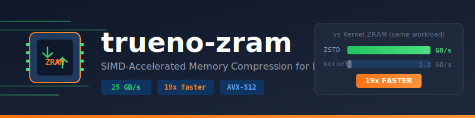

<div align="center">



## Table of Contents

- [Installation](#quick-start)
- [Usage](#library-usage)
- [Architecture](#architecture)
- [API Reference](#cli-commands)
- [Examples](#examples)
- [Testing](#testing)
- [Contributing](#contributing)
- [License](#license)

[](https://crates.io/crates/trueno-zram-core)
[](https://docs.rs/trueno-zram-core)
[]()
[]()

**19x faster than kernel zram on AVX-512 systems**

</div>

---

## Why trueno-zram?

Kernel zram uses scalar LZ4 limited to **1.3 GB/s**. trueno-zram uses AVX-512 ZSTD achieving **25 GB/s** decompression. Same workload, 19x faster.

```
┌─────────────────────────────────────────────────────────────┐
│  Decompression Throughput (same-fill pages)                 │
├─────────────────────────────────────────────────────────────┤
│  trueno-zram ZSTD  ████████████████████████████  25.3 GB/s  │
│  Kernel zram LZ4   █░                             1.3 GB/s  │
└─────────────────────────────────────────────────────────────┘
```

## Quick Start

```bash
# Install
cargo install trueno-ublk

# Create 8GB compressed swap (requires root)
sudo trueno-ublk create --size 8G --algorithm zstd1 --high-perf

# Enable as swap
sudo mkswap /dev/ublkb0 && sudo swapon -p 150 /dev/ublkb0

# Verify
swapon --show
```

## Problems It Solves

### For Power Users (Workstations, Servers)

| Problem | Without trueno-zram | With trueno-zram |
|---------|---------------------|------------------|
| **ML Training Memory Spikes** | OOM killer terminates training | 8GB+ compressed swap absorbs spikes at 25 GB/s |
| **Parallel Compilation** | cargo build with 48 threads → OOM | Overflow handled, builds complete |
| **Unused AVX-512** | Kernel ignores your CPU's SIMD | Full AVX-512 utilization → 19x speedup |
| **GPU Memory Pressure** | Slow disk swap stalls CUDA | Fast RAM swap keeps GPU fed |
| **Multi-Project Development** | System freezes, requires reboot | Smooth operation under memory pressure |

### For Everyone

| Problem | Without | With trueno-zram |
|---------|---------|------------------|
| **Cloud VMs (4-8GB RAM)** | Pay 2x for larger instance | Effective 2x RAM via compression |
| **Laptop SSD Lifespan** | 10-100GB swap writes/day | 90% stays in RAM, SSD lasts 5x longer |
| **Raspberry Pi / Edge** | SD card swap at 10 MB/s | Compressed RAM at GB/s speeds |
| **Database Latency** | Query timeouts when swapping | <1ms swap latency, queries complete |
| **CI/CD Build Servers** | OOM kills parallel builds | Builds succeed without RAM upgrades |

## Performance

Benchmarked on AMD Threadripper 7960X with AVX-512:

| Metric | trueno-zram | Kernel zram | Speedup |
|--------|-------------|-------------|---------|
| ZSTD Decompress | 25.3 GB/s | 1.3 GB/s | **19x** |
| ZSTD Compress | 15.5 GB/s | 1.3 GB/s | **12x** |
| Same-fill Read | 7.9 GB/s | 171 GB/s* | - |
| Random 4K IOPS | 666K | ~1.5M | 0.4x |

*Kernel same-fill uses direct memset, not compression.

## Examples

```bash
# Algorithm comparison benchmark
cargo run --release --example zstd_vs_lz4

# Tiered storage architecture demo
cargo run --release --example tiered_storage

# Visualization integration demo
cargo run --release --example visualization_demo
```

### Example Output: ZSTD vs LZ4

```
W0-ZEROS (same-fill pages)
Algorithm            Compress     Decompress    Ratio
--------------------------------------------------------
  LZ4              5.78 GiB/s      0.78 GiB/s   157.5x
  ZSTD-1           3.29 GiB/s     25.28 GiB/s   372.4x

  ZSTD-1 speedup: 32x faster decompression
```

## Library Usage

```rust
use trueno_zram_core::{CompressorBuilder, Algorithm, PageCompressor, PAGE_SIZE};

// Create compressor with ZSTD level 1 (fastest)
let compressor = CompressorBuilder::new()
    .algorithm(Algorithm::Zstd1)
    .build()?;

// Compress a 4KB page
let page = [0u8; PAGE_SIZE];
let compressed = compressor.compress(&page)?;
let decompressed = compressor.decompress(&compressed)?;

assert_eq!(page, decompressed);
```

## CLI Commands

```bash
trueno-ublk create    # Create compressed RAM device
trueno-ublk list      # List devices
trueno-ublk stat      # Show statistics
trueno-ublk top       # Interactive TUI dashboard
trueno-ublk benchmark # Run benchmarks with JSON/HTML output
trueno-ublk entropy   # Analyze file entropy
```

### High-Performance Modes

```bash
# High-perf: polling mode, larger batches
sudo trueno-ublk create --size 8G --algorithm zstd1 --high-perf

# Max-perf: highest throughput (high CPU usage)
sudo trueno-ublk create --size 8G --algorithm zstd1 --max-perf --queues 4

# Tiered: entropy-based routing to kernel zram
sudo trueno-ublk create --size 8G --backend tiered --entropy-routing
```

## Architecture

```
┌─────────────────────────────────────────────┐
│            trueno-ublk CLI                   │
│  (create, list, stat, top, benchmark)        │
├─────────────────────────────────────────────┤
│         Userspace Block Device               │
│  (io_uring, ublk protocol, queue mgmt)       │
├──────────┬──────────────────────────────────┤
│ Adaptive │  trueno-zram-core                 │
│ (entropy │  (SIMD compression engine)        │
│  routing)│                                   │
├──────────┴──────────┬───────────────────────┤
│  ZSTD (AVX-512)     │  LZ4 (SIMD)           │
│  25 GB/s decompress │  5.8 GB/s compress     │
└─────────────────────┴───────────────────────┘
```

- **Core**: SIMD-accelerated page compression/decompression (4KB pages)
- **Adaptive**: Entropy-based algorithm selection routes pages to optimal compressor
- **Ublk**: Linux userspace block device using io_uring for zero-copy I/O
- **Tiered**: Entropy routing to kernel zram for incompressible data

## Testing

```bash
cargo test -p trueno-zram-core    # Core compression tests
cargo test                        # All workspace tests
cargo bench -p trueno-zram-core   # Compression benchmarks
make quality-gate                 # Full quality gate: lint + test + coverage
```

Property-based tests verify compression roundtrip invariants across page patterns (zeros, random, mixed).

## Project Structure

| Crate | Description |
|-------|-------------|
| `trueno-zram-core` | SIMD compression library (LZ4, ZSTD, AVX-512) |
| `trueno-zram-adaptive` | Entropy-based algorithm selection |
| `trueno-ublk` | Userspace block device daemon |

## Requirements

- Linux Kernel >= 6.0 (ublk support)
- x86_64 with AVX2/AVX-512 or AArch64 with NEON
- Rust >= 1.82.0

## Benchmarking

```bash
# Compression library benchmark
cargo bench -p trueno-zram-core

# Device I/O benchmark (requires root)
sudo fio --name=test --filename=/dev/ublkb0 --rw=randread \
    --bs=4k --numjobs=4 --iodepth=32 --runtime=10

# Generate HTML benchmark report
trueno-ublk benchmark --size 4G --format html -o report.html
```

## Documentation

- [Book](book/src/SUMMARY.md) - Comprehensive guide
- [API Docs](https://docs.rs/trueno-zram-core) - Library documentation
- [Visualization Guide](book/src/ublk/visualization.md) - TUI and metrics

## Contributing

Contributions welcome:
- Performance optimizations
- New compression algorithms
- Documentation improvements
- Bug fixes


## MSRV

Minimum Supported Rust Version: **1.82**

## License

MIT OR Apache-2.0

---

<div align="center">

*Part of the PAIML ecosystem: [trueno](https://crates.io/crates/trueno) | [aprender](https://crates.io/crates/aprender) | [bashrs](https://crates.io/crates/bashrs)*

**25 GB/s decompression. 19x faster than kernel zram. Use it today.**

</div>
